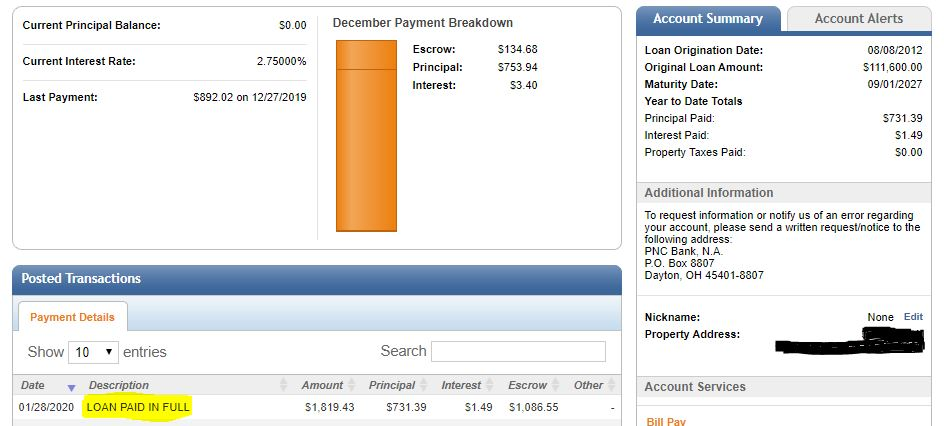

Back in my 2018 "year in review" post I mentioned that towards the end of the year we shifted from aggresively paying down the mortgage to investing more into our 401k.  Since that time we have just been making the minimum payments on our 15 year mortgage (First home / Rental property).

Entering 2020, we had $731 dollars left on the loan.  Now the loan is paid in full! This is great because it frees up some cash.  We paid roughly $758 dollars a month going towards principal and interest.  

Now, I realize that that is a lot of equity in the home to not be tapping into or leveraging to aquire new properties.  However we did tap into some equity on our primary home by taking out a heloc in order to come up with a downpayment to aquire an additional duplex.  

The duplex is being built and should finish construction within the next 3-4 months.  The property should provide a small amount of cashflow up front.  However we are mitigating some risk by having the additonal cash flow from the paid off rental to help payback the HELOC loan and to help cover payments on the new property in the unlikely scenario that we can't find enough rental income to cover the new mortgage.

Once our HELOC loan is paid back, we can leverage that equity to aquire a new property and keep going from there.  Not the most agressive approach, but it's one we feel comfortable with.  

We continued to invest heavily in retirement funds through 2019.  That combined with massive gains in the markets, boded well for us. 

**January 29th Break Down**

401K: $63,577  
ROTH 401K: $12,689      
Roth IRA: $53,564    
HSA: $32,222    

Total:$162,052  

For historical context check out a graph of our [NetWorth over time](/Net-Worth/profile/?user=yhxzTiGfYRe5j5IpB6Xw2nmZUTJ2){:target="_blank"}.

